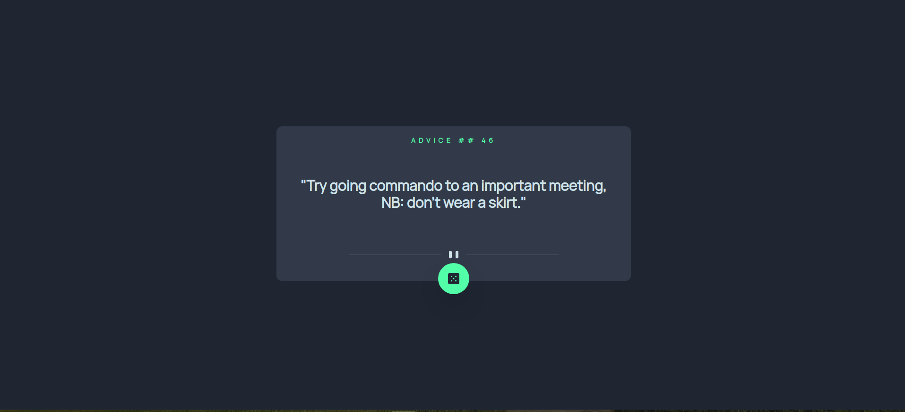

# Frontend Mentor - Advice generator app solution

This is a solution to the [Advice generator app challenge on Frontend Mentor](https://www.frontendmentor.io/challenges/advice-generator-app-QdUG-13db). Frontend Mentor challenges help you improve your coding skills by building realistic projects.

## Table of contents

- [Frontend Mentor - Advice generator app solution](#frontend-mentor---advice-generator-app-solution)
  - [Table of contents](#table-of-contents)
  - [Overview](#overview)
    - [The challenge](#the-challenge)
    - [Screenshot](#screenshot)
    - [Links](#links)
  - [My process](#my-process)
    - [Built with](#built-with)
    - [What I learned](#what-i-learned)
    - [Continued development](#continued-development)
  - [Author](#author)
  - [Acknowledgments](#acknowledgments)

**Note: Delete this note and update the table of contents based on what sections you keep.**

## Overview

### The challenge

Users should be able to:

- View the optimal layout for the app depending on their device's screen size
- See hover states for all interactive elements on the page
- Generate a new piece of advice by clicking the dice icon

### Screenshot




### Links

- Solution URL: [Add solution URL here](https://your-solution-url.com)
- Live Site URL: [Add live site URL here](https://your-live-site-url.com)

## My process

### Built with

- Semantic HTML5 markup
- CSS custom properties
- Flexbox
- Mobile-first workflow
- [React](https://reactjs.org/) - JS library
- [Vite.js](https://vitejs.dev/) - Vite JS framework
- [Tailwind CSS](https://tailwindcss.com/) - For styles


### What I learned

its good to learn how to useEffect hooks in react, since i am still new in react js,
To see how you can add code snippets, see below:

```js
  function setAdviced() {
    console.log("call here");
    fetch("https://api.adviceslip.com/advice")
      .then((response) => response.json())
      .then((data) => {
        setAdviceId(data.slip.id);
        setAdvice(data.slip.advice);
      });
  }

  useEffect(() => {
    console.log("call this effect");
    setAdviced();
  });

```
```html
<article className="relative flex flex-col items-center align-middle justify-center md:min-w-500 md:max-w-750 rounded-xl md:px-8 min-w-0 p-0">
          <p className="id-advice py-5 text-neonGreen text-sm tracking-widest font-bold">
            ADVICE ## {adviceId}
          </p>
```

### Continued development

Use this section to outline areas that you want to continue focusing on in future projects. These could be concepts you're still not completely comfortable with or techniques you found useful that you want to refine and perfect.

**Note: Delete this note and the content within this section and replace with your own plans for continued development.**

## Author

- Frontend Mentor - [@cahyaresa](https://www.frontendmentor.io/profile/cahyaresa)

## Acknowledgments
